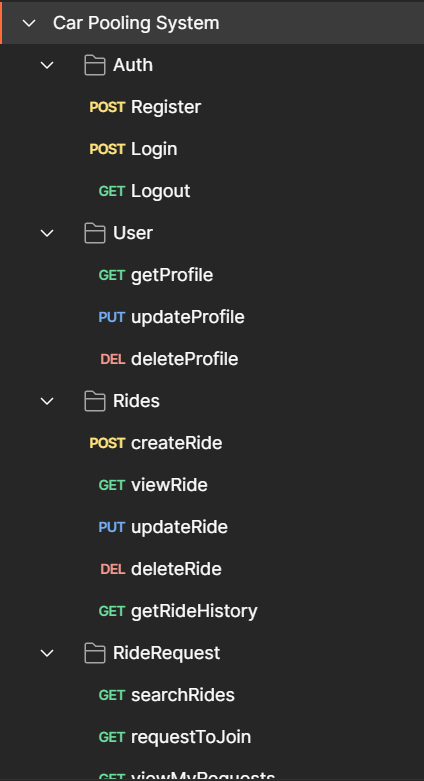

# MERN Stack Carpooling System

A full-stack ride-sharing platform built using the MERN stack (MongoDB, Express.js, React.js, Node.js), supporting real-time and privacy-aware carpooling for drivers and riders.


## Features

### Authentication
- Secure user authentication using JWT tokens.
- Role-based login support for drivers and riders.
- Token-based route protection with middleware for backend security.


### User Profiles


- Profile includes personal preferences, emergency contacts, and token storage.
- Privacy options for phone number masking, blurred profile pics, and minimal public exposure.


### Driver Features
- Create, edit, and delete rides.


- View personal ride history.


- Manage incoming ride requests (approve/reject).


- Add vehicle details and ride preferences (e.g., music, smoking, pet policy).


### Rider Features
- Search rides based on pickup, drop, and date.
<!--  -->

- Request to join rides and track request status.
<!--  -->

### Ride Matching & Management
- Intelligent matching using pickup, drop, timing, and preferences.
- Avoids duplicate or unauthorized ride requests.
- Manages seat count and ride lifecycle.
- Calculates route match percentage to help users make better decisions.


### Additional Key Features
- Emergency contact integration per user profile.
- Real-time dashboard for driver request approvals.

## Tech Stack

### Frontend
- React.js
- Axios
- React Router
- Tailwind CSS

### Backend
- Node.js
- Express.js
- MongoDB & Mongoose
- JWT + Refresh Tokens
- Bcrypt.js (Password Hashing)
### Prerequisites
- Node.js and npm
- MongoDB (local/cloud)
- React (Vite/CRA)
### Backend Setup
Create a `.env` file in the `backend` directory:

```env
PORT=5000
MONGO_URI=your_mongodb_uri
ACCESS_TOKEN_SECRET=your_access_token_secret
REFRESH_TOKEN_SECRET=your_refresh_token_secret
```

Install dependencies and start the backend server:

```bash
cd backend
npm install
npm run dev
```
### Frontend Setup
Install dependencies and start the frontend server:
```bash
cd frontend
npm install
npm run dev
```
### Folder Structure
```
/backend
  ├── controllers/
  ├── models/
  ├── routes/
  ├── middleware/
  └── server.js

/frontend
  ├── components/
  ├── context/
  └── main.jsx
```
### Future Improvements:
- SOS alert and real-time location sharing
- Real-time updates using WebSockets
- Notifications for approval and ride events
- Google Maps API for enhanced route accuracy
- Ride invitations via WhatsApp/email sharing
### Author
Lohith Marneni
BTech, SRM University-AP
Reg. No: AP22110011121
LinkedIn - https://www.linkedin.com/in/lohith-marneni/
### License
This project is a submission for the MoveInSync recruitment assignment.
### ✔️ Evaluation Criteria Coverage

| Criteria                | Implemented                                                        |
|------------------------|---------------------------------------------------------------------|
| Authentication         | Robust JWT auth with role-based access                             |
| Time/Space Optimization| Efficient MongoDB queries, pagination, and caching planned          |
| System Failure Handling| Middleware and fallback APIs with error logs and handling           |
| OOPS Principles        | Modular Node.js with Express controllers and middleware             |
| Trade-offs             | Documented trade-offs between performance and complexity            |
| Monitoring             | Console logs, error middleware, scoped to future tools              |
| Caching                | Redis/memory caching scope defined for ride searches                |
| Error Handling         | Global and route-specific error handling with status codes          |

For a detailed project report/documentation, refer to **CarpoolingSystem_Report.pdf** (attached separately).


   